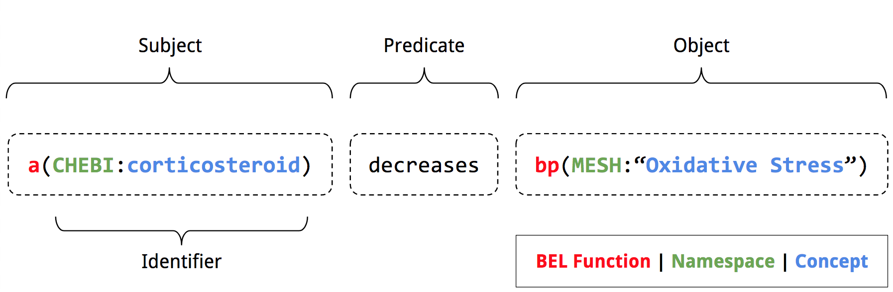
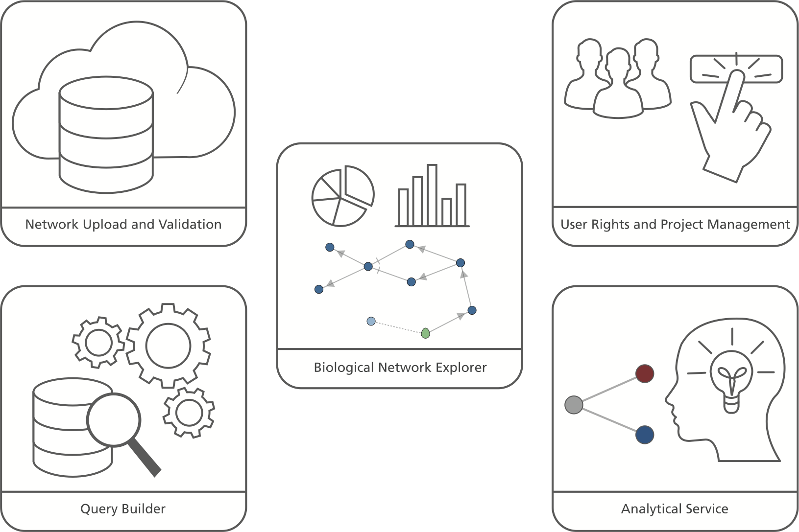
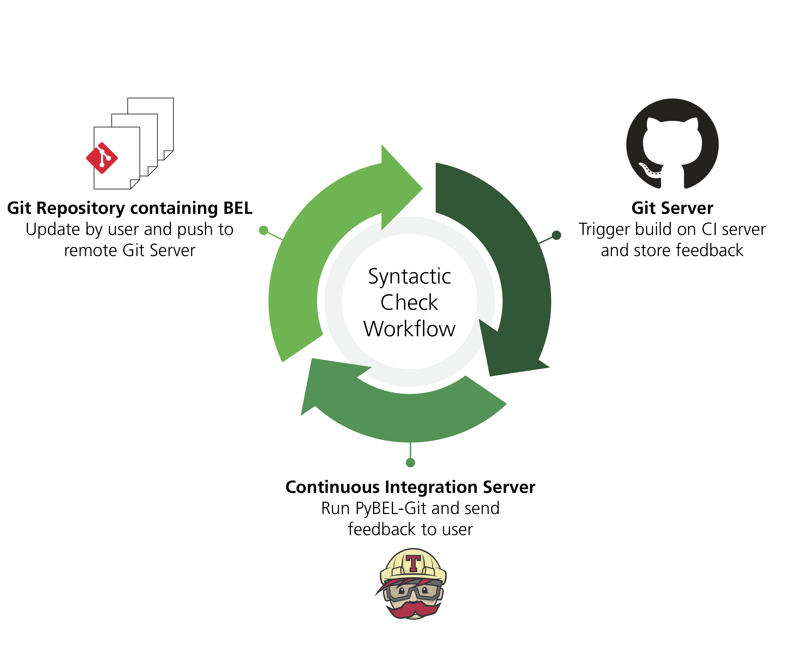
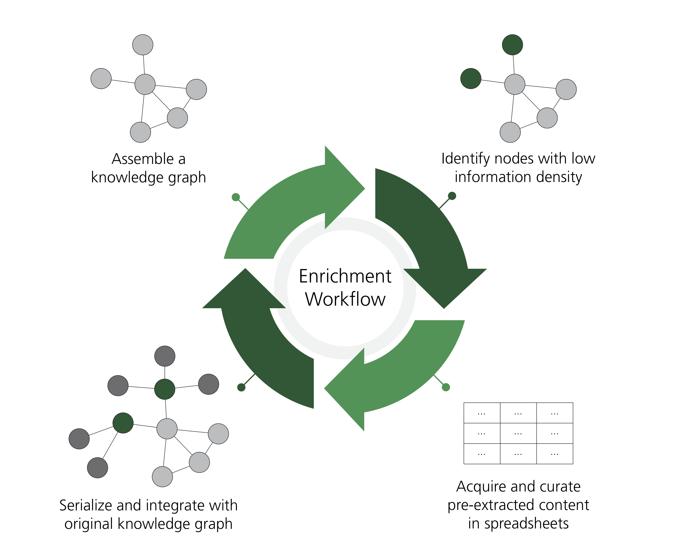
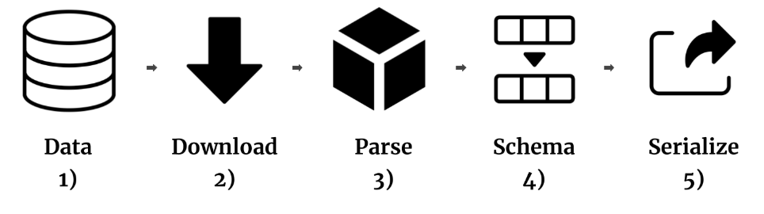
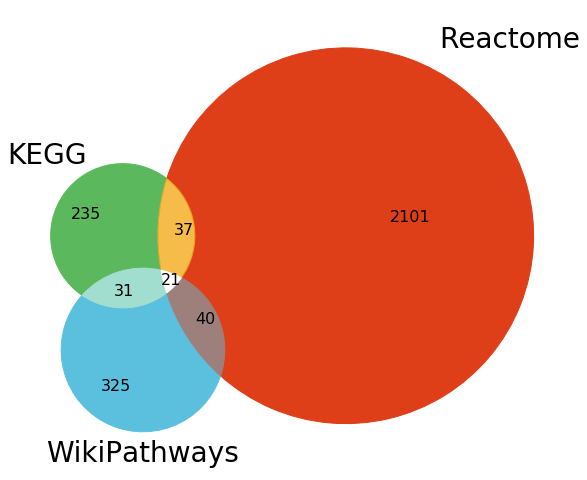
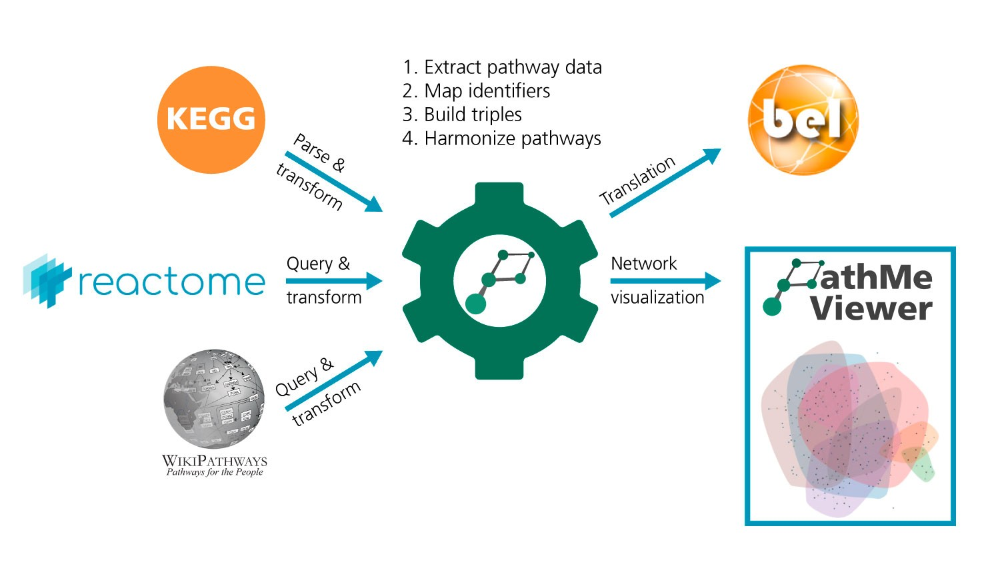
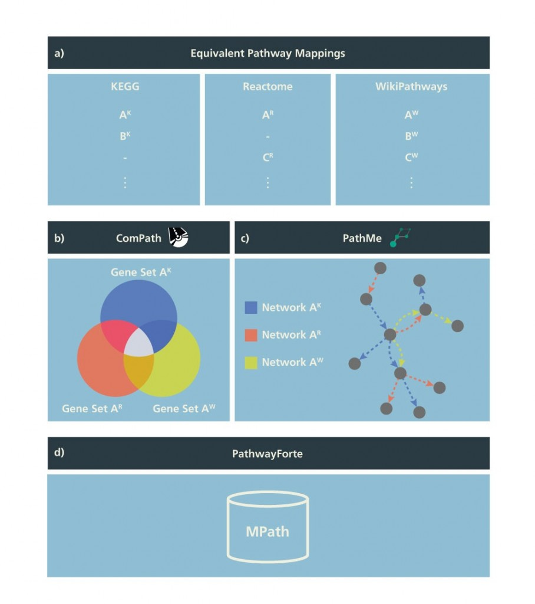
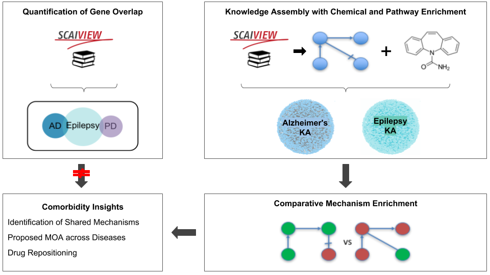

# The Human Brain Pharmacome Project

This page outlines the resources generated for the Human Brain Pharmacome project.

## Knowledge Storage, Manipulation, and Exploration

One of the first goals of the Human Brain Pharmacome Project is to bring order
to the unstructured knowledge locked in the biomedical literature, patents,
and electronic health records.

### Storing Knowledge: Biological Expression Language

We heavily rely on Biological Expression Language (BEL) as a format for storing qualitative causal and correlative 
relations between biological entities across multiple modes and scales, with full provenance information including 
namespace references, relation provenance (citation and evidence), and biological context-specific relation metadata 
(anatomy, cell, disease etc.)

#### Reference

Slater, T. (2014). [Recent advances in modeling languages for pathway maps and computable biological networks](https://doi.org/10.1016/j.drudis.2013.12.011). *Drug Discovery Today*, 19(2), 193–198. 

#### Resources

- BEL Enhancement Proposals: [https://github.com/belbio/bep](https://github.com/belbio/bep)

### Manipulating Knowledge: PyBEL

 We built 
PyBEL for parsing, validating, compiling, and converting networks encoded in BEL. PyBEL comprises five main components:
(i) network data container, (ii) parser and validator, (iii) network database manager, (iv) data converter and (v) 
network visualizer.

#### Reference

Hoyt, C. T., Konotopez, A., Ebeling, C. (2018). [PyBEL: a computational framework for Biological Expression Language](https://doi.org/10.1093/bioinformatics/btx660). *Bioinformatics*, 34(4), 703–704. 

#### Resources

- [Code](https://github.com/pybel/pybel)
- [Documentation](http://pybel.readthedocs.io)

### Exploring Knowledge: BEL Commons

 
BEL Commons is an environment for curating, validating, and exploring knowledge assemblies encoded in BEL to support 
elucidating disease-specific, mechanistic insight. BEL Commons comprises five components: (i) the network uploader and 
validator, (ii) user rights and project management, (iii) the query builder, (iv) the biological network explorer and 
(iv) the analytical service.

#### Reference

Hoyt, C. T., Domingo-Fernández, D., & Hofmann-Apitius, M. (2018). [BEL Commons: an environment for exploration and analysis of networks encoded in Biological Expression Language](https://doi.org/10.1093/database/bay126). *Database*, 2018(3), 1–11.

#### Resources

- Web Application: [https://bel-commons.scai.fraunhofer.de](https://bel-commons.scai.fraunhofer.de)
- [Code](https://github.com/bel-commons)

## Curation of Unstructured Knowledge

### BEL Curation Workflow

We developed a workflow using [git](https://git-scm.com), [GitHub](https://github.com), PyBEL, and a novel [PyBEL
extension](https://github.com/pybel/pybel-git) in order to identify and address syntactical issues in BEL documents 
in a Continuous Integration setting.

#### Resources

- [Source Code](https://github.com/pybel/pybel-git)
- [Zenodo Reference](http://doi.org/10.5281/zenodo.2508180): Hoyt, C. T. (2018, December 22). pybel/pybel-git v0.0.2 (Version v0.0.2). Zenodo. http://doi.org/10.5281/zenodo.2508180

### Curation of Neurodegeneration Supporting Ontology (CONSO)

While there are several useful public terminologies useful for curation of biomedical relations, there is often the 
need to develop new controlled vocabularies, thesauri, taxonomies, and ontologies. We have maintained ours with the
ability to export it as OBO, OWL, and as a BEL namespace.

#### Resources

- [Summary](https://pharmacome.github.io/terminology)
- [Data](https://github.com/pharmacome/terminology)

### Curation of Neurodegeneration in BEL (CONIB)

We have prioritized manual curation of the highest granularity for new content related to several neurodegenerative
disease, with special focus on the human Tau protein, nicotoinic receptor biology, and proteostasis. They can be
downloaded and handled with PyBEL (or other BEL tools) using the link below.

#### Resources

- [Summary](https://pharmacome.github.io/conib)
- [Data](https://github.com/pharmacome/conib)

### NeuroMMSig

Multimodal mechanistic signatures for neurodegenerative diseases (NeuroMMSig) consists of three parts: a taxonomy
of candidate pathophysiological mechanisms in three neurodegenerative diseases (i.e., Alzheimer's disease, Parkinson's 
disease, and epilepsy), disease-specific mechanistic models of each, and a web server implementing
a novel mechanism enrichment algorithm.

#### Mechanism Taxonomy Resources

- [Data](https://github.com/neurommsig/neurommsig-terminology)

#### Mechanism Inventory Resources

- [Summary](https://neurommsig.github.io/neurommsig-knowledge)
- [Data](https://github.com/neurommsig/neurommsig-knowledge)

#### Mechanism Enrichment Server Reference

Domingo-Fernández, D., *et al.* (2017). [Multimodal mechanistic signatures for neurodegenerative 
diseases (NeuroMMSig): A web server for mechanism enrichment](https://doi.org/10.1093/bioinformatics/btx399). 
*Bioinformatics*, 33(22), 3679–3681. 

#### Mechanism Enrichment Server Resources

- Web Application: [https://neurommsig.fraunhofer.de](https://neurommsig.fraunhofer.de)

### Rational Enrichment of NeuroMMSig

#### Reference

Hoyt, C. T., *et al* (2019). [Re-curation and Rational Enrichment of Knowledge Graphs in Biological Expression 
Language](https://doi.org/10.1093/database/baz068). *Database*, 2019. 

#### Resources

- [Summary](https://bel-enrichment.github.io/results/)
- [Data](https://github.com/bel-enrichment/results)
- [Code](https://github.com/bel-enrichment/bel-enrichment)

### Topic-driven Semi-Automated Curation

We used the tooling developed for the rational enrichment workflow to support topic-specific, semi-automated 
curation. So far, it has been applied to the MAPT and GSK3B proteins.

#### Resources

- [Summary](https://pharmacome.github.io/semi-automated-curation)
- [Data](https://github.com/pharmacome/semi-automated-curation)

### TauBase

We've generated a dynamic web application for exploring the content curated during this project that can be found
at [https://github.com/pharmacome/taubase](https://github.com/pharmacome/taubase]). It will be deployed publicly soon.

## Acquisition and Transformation of Structured Knowledge

### Bio2BEL

 
BEL is well-suited as an biomedical knowledge integration standard as it has precise semantics and is extensible. We
generated several reusable packages for converting and harmonizing databases across modes and scales in BEL.

#### Reference

Hoyt, C. T., *et al.* (2019). [Integration of Structured Biological Data Sources using Biological Expression Language](https://doi.org/10.1101/631812). *bioRxiv*, 631812. 

#### Resources

- [Code](https://github.com/bio2bel)

### ComPath

 
We curated mappings between three major pathway databases (KEGG, Reactome, and WikiPathways) and MSigDB to identify
their overlapping entries.

#### Reference

Domingo-Fernandez, D., *et al*. (2018). [ComPath: an ecosystem for exploring, analyzing, and curating mappings across 
pathway databases](https://doi.org/10.1038/s41540-018-0078-8). *Npj Systems Biology and Applications*, 4:43.

#### Resources

- Web Application: [https://compath.scai.fraunhofer.de](https://compath.scai.fraunhofer.de)
- [Code](https://github.com/ComPath/ComPath)

### PathMe

We harmonized and extracted pathway knowledge from three major pathway databases: KEGG, Reactome, and WikiPathways
in order to make comparisons about their coverage and to generate consensus pathways (by using ComPath) for downstream
applications, such as with Signalling Pathway Impact Analysis (SPIA). 

#### Reference

Domingo-Fernandez, D., *et al.* (2018). [PathMe: Merging and exploring mechanistic pathway knowledge](https://doi.org/10.1186/s12859-019-2863-9). *BMC Bioinformatics*, 20:243.

#### Resources

- Web Application: [https://pathme.scai.fraunhofer.de](https://pathme.scai.fraunhofer.de)
- [Code](https://github.com/pathwaymerger/pathme)

### PathwayForte

We generated super-pathways using ComPath and PathMe in order to benchmark several pathway-based functional
enrichment and prediction methods.

#### Reference

Mubeen, S., *et al.* (2019). [The Impact of Pathway Database Choice on Statistical Enrichment Analysis and Predictive Modeling](https://doi.org/10.3389/fgene.2019.01203). *Frontiers in Genetics*, 10:1203. 

#### Resources

- [Code](https://github.com/pathwayforte)

## Analytical Approaches

### Comparative Mechanism Enrichment

We proposed an explanation for the cross-indication effects of Carbamazepine towards epilepsy and Alzheimer's disease
by using the NeuroMMSig mechanism enrichment server to identify overlapping mechanisms with its experimentally measured 
and computationally predicted targets.

#### Reference

Hoyt, C. T. and Domingo-Fernández, D., *et al.* (2018). [A systematic approach for identifying shared mechanisms in 
epilepsy and its comorbidities](https://doi.org/10.1093/database/bay050). *Database*, 2018(1). 

### Target Prioritization with Network Representation Learning

We used GAT2VEC to generate random walk-based node embeddings for protein-protein interaction (PPI) networks annotated 
with disease-specific differential gene expression profiles from GEO, ArrayExpress, and other sources. Following
the prediction and evaluation pipeline from [Emig, *et al.* (2013)](https://doi.org/10.1371/journal.pone.0060618), we 
built simple generalized linear models using annotations from OpenTargets as a training set and generated rankings for 
all targets.

#### References

Muslu, Ö., Hoyt, C. T., Hofmann-Apitius, M., & Fröhlich, H. (2019). [GuiltyTargets: Prioritization of Novel 
Therapeutic Targets with Deep Network Representation Learning](https://doi.org/10.1101/521161). *bioRxiv*, 1–14. 

#### Resources

- [Code](https://github.com/guiltytargets)

### Link Prediction with Network Representation Learning

We generated two network representation learning (NRL) libraries: [one](https://github.com/cthoyt/nrl) for random 
walk-based NRL and [another](https://github.com/smartDataAnalytics/pykeen) for semantic translations models and
neural network models.

#### Reference

Ali, M., Hoyt, C. T., Domingo-Fernández, D., Lehmann, J., & Jabeen, H. (2019). [BioKEEN: A library for learning and evaluating biological knowledge graph embeddings](https://doi.org/10.1093/bioinformatics/btz117). *Bioinformatics*, btz117. 

#### Resources

- [Code (NRL)](https://github.com/cthoyt/nrl)
- [Code (PyKEEN)](https://github.com/smartDataAnalytics/pykeen)
- [Code (BioKEEN)](https://github.com/smartDataAnalytics/biokeen)

### Side Effect Prediction with Network Representation Learning

We generated node and edge embeddings for a graph of drugs, their chemical similarities, their side effects, their indications, their targets in order to predict side effects for new chemicals as well as to propose mechanisms of action for some side effects.

#### Resources

- [Code](https://github.com/aldisirana/SE_KGE)
- *master's thesis in preparation*

### Drug Repositioning with Network Representation Learning

We replaced the engineered features used by [Himmelstein *et al.* (2017)](https://doi.org/10.7554/eLife.26726) with features learned by [node2vec](https://cs.stanford.edu/~jure/pubs/node2vec-kdd16.pdf) on the [RepHetNet](https://het.io/repurpose/).

#### Resources

- [Code](https://github.com/lingling93/comparison)
- *master's thesis in preparation*

## Funding

We're funded by the Fraunhofer Society's MAVO program as a joint undertaking between 
[Fraunhofer SCAI](https://www.scai.fraunhofer.de/), [Fraunhofer IAIS](https://www.iais.fraunhofer.de), 
and [Fraunhofer IME](https://www.ime.fraunhofer.de/). Also, see our [blog](https://pharmacome.scai.fraunhofer.de/).
